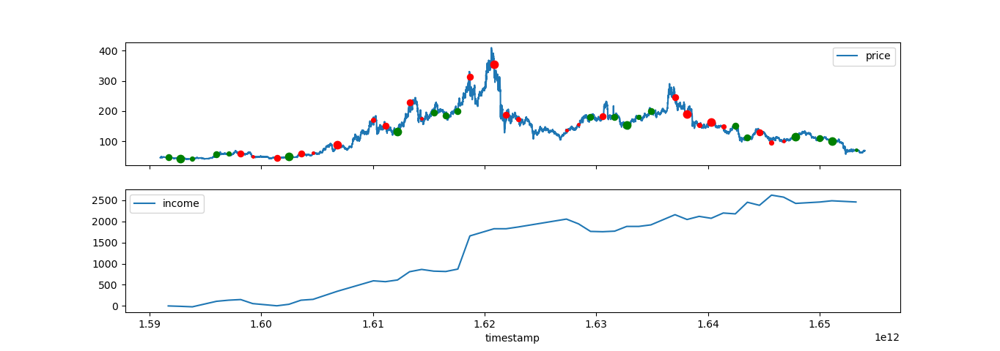

# Engine-RB30

# Description

Engine-RB30 is a framework to backtest and run live your market strategies.

# Quick start

1. provide .env file with name of strategy existing in strategies folder like:
~~~
STRATEGY_PATH="/home/name/workspace/strategies/hackaton1"
~~~
1. To install dependencies locally run: "bash install_dependencies_locally.sh"

2. Run local backtest with command: "python3 run_all.py"

# Strategy implementation using python engine

In folder "strategies" add folder with your strategy name and create three files: "data_schema.py", "executor.py", "model.py"
All the data related to your strategy like models, 

## Data schema

In "data_schema.py" configure your input data schema and strategy intervals using "DataSchema" interface and list of avaliable instruments avaliable in adequate data source.

Avaliable data sources: 
- [ binance ] 
  - avaliable instruments in "historical_data_feeds/binance_instruments.txt"
- [ ducascopy ] 
  - avaliable instruments in https://github.com/Leo4815162342/dukascopy-node
- [ exante ] 
  - avaliable instruments in https://drive.google.com/drive/folders/1qJAGedEWhGehG2Hh48ITgE7LjGWwyzOw?usp=sharing
  - used package: https://github.com/xntltd/python-http-api
- [ coingecko ] 
  - avaliable instruments in https://docs.google.com/spreadsheets/d/1wTTuxXt8n9q7C4NDXqQpI3wpKu1_5bGVmP9Xz0XGSyU/edit?usp=sharingdescription
  - description in: https://www.coingecko.com/en/api/documentation
  - used package: https://github.com/man-c/pycoingecko
  
Variables in data elements explanation: 
- [ symbol ] - string representing one of instruments from provided data source.
- [ historical_data_source ] - HISTORICAL_SOURCES enum element.
- [ main ] - instrument on which transactions are made on. Only one instrument must have main set on True.
- [ backtest_date_start ] - start of historical data
- [ backtest_date_stop ] - end of historical data
- [ trigger_feed ] - Decision if this data feeds triggers on_feed function in your model with new buffer update. At least one instrument must have trigger_feed set on True.
- [ interval ] - Element of intervals enum corresponding to provided historical data source.
~~~
from backtesterRB30.libs.utils.data_imports import *

data={
    'data':[
        {
            'symbol': '2914jpjpy',
            'historical_data_source': HISTORICAL_SOURCES.ducascopy,
            'main': False,
            'backtest_date_start': datetime(2021,5,1),
            'backtest_date_stop': datetime(2022,8,1),
            'trigger_feed': False,
            'interval': DUKASCOPY_INTERVALS.hour,
        },
        {
            'symbol': 'iefususd',
            'historical_data_source': HISTORICAL_SOURCES.ducascopy,
            'main': True,
            'backtest_date_start': datetime(2021,5,1),
            'backtest_date_stop': datetime(2022,8,1),
            'trigger_feed': True,
            'interval': DUKASCOPY_INTERVALS.hour
        }
    ]
}
DATA = validate_config(data)
~~~

## Model class

In "model.py" configure your model class named Model ingeriting from Engine.
Override "on_feed" function which is triggered every interval you have choosen.
In this class, you can use "_trigger_event" function inheritet from Engine class. This function triggers your "on_event" method in executor file.
In this class, you can use "_set_buffer_length" which sets buffer length that is provided to on_feed method.

Avaliable methods to overload: 
- "of_feed"
- "on_data_finish"

Avaliable methods to use: 
- "_get_columns" - Gets instrument names in proper order fitting to data provided to "on_feed" method.
- "_get_main_intrument_number" - Gets number of instrument in your data array that is main instrument.
- "_set_buffer_length" - Sets data buffer length provided to "on_feed" method
- "_trigger_event" - Triggers Trade executor "event" method.
- "_add_custom_chart" - Adds custom chart printed in summary.
- "_debug_breakpoint" - Adds breakpoint where your code stops in debug mode.
- "_add_reloading_module" - Add module that is going to be live reloaded while using debug mode.
- "_log" - triggers console log

Below you can check basic example with random trades:
~~~
from backtesterRB30.libs.utils.model_imports import *
from random import randint

class Model(Engine):
    
    def __init__(self, config):
        super().__init__(config)
        self.counter = 0
        self._set_buffer_length(200)

    #override
    async def on_feed(self, data: list):
        if self.counter % 30 == 0:
            quant = randint(-2,2)
            if quant != 0:
                message = {
                    'value': quant
                }
                self._trigger_event(message)
        self.counter += 1
~~~

Below you can check alternative example with live reloading function that allows you live developement in debug mode. The live_reloading_function can be in any outside module. All Model attributes that you want to use in this function must be passed by arguments.
~~~
from backtesterRB30.libs.utils.model_imports import *
from random import randint

async def live_reloading_function(data, state, _trigger_event, _debug_breakpoint):
    if state['counter'] % 30 == 0:
        quant = randint(-2,2)
        if quant != 0:
            message = {
                'value': quant
            }
            await _debug_breakpoint()
            _trigger_event(message)
    state['counter'] += 1

class Model(Engine):
    
    def __init__(self, config):
        super().__init__(config)
        self.state = {
            'counter': 0
        }
        self._set_buffer_length(200)
        self.live_reloading_module = self._add_reloading_module(
                'strategies.'+self.config.strategy_name+'.model')
        
    #override
    async def on_feed(self, data: list):
        await self.live_reloading_module.live_reloading_function(
                data, self.state, self._trigger_event, self._debug_breakpoint)

~~~

## Executor class

In "executor.py" configure your trade executor class named TradeExecutor inheriting from Executor.
Override "on_event" triggered while your implemented model returns event. In this class, you can use "_trade" function inheritet from Executor class.

All avaliable methods to overload: 
- "on_event"

Avaliable methods to use: 
- "_trade"
- "_close_all_trades"
- "_get_number_of_actions"
- "_log"

Below you can check simple executor class that triggers trade based on Model message:
~~~
from backtesterRB30.libs.utils.executor_imports import *

class TradeExecutor(Executor):

    def __init__(self, config):
        super().__init__(config)

    #override
    def on_event(self, message):
        self._trade(message['value'])
~~~

# Debug mode

## Usage of debug mode
Framework gives you access to debug mode that allows you printing summary charts and descriptions every step of your debug. To enable use debug while implementing your strategy follow below steps:
- Use "_debug_breakpoint" method somewhere in your "on_feed" method. This works as breakpoint while debugging. The code will stop in this place.
- Press "ctrl+d" in any moment during backtest loop. This will cause entering debug mode and stopping the code in the nearest moment when your code occurs "_debug_breakpoint" function. You should also se summary and charts printed for current moment of backtest.
- Press "ctrl+n" for next.
- Press "ctrl+q" for quit debug mode.

#TODO gif

## Live code reloads
Debug mode enables user to develop his strategies live with backtest running in debud mode. Thats only possible importable modules to bo live reloaded. To achive this use "_add_reloading_module(path_to_module)" in the init function in your Model class. As an argument to the function pass the path to the module you are goint to be reloaded after every step of your debug.

To preview how it works you can run example strategy in "TODO"

example:

~~~
# TODO
~~~

# Library implementation

If you are implementing piece of code that can be usefull in other strategies, use "libs" folder. It will be avaliable to import in other strategies or notebooks.
Your communication interfaces include in "libs/interfaces" folder.

# Data source implementation
1. In "libs/utils/historical_sources.py 
   1. add your source to HISTORICAL_SOURCES enum
   2. add enum class with your avaliable intervals by analogy to BINANCE_INTERVALS.
   3. add your intervals enum to HISTORICAL_INTERVALS_UNION
2. Add class to "historical_data_feeds/modules" folder.
3. Register your class in historical_data_feeds/historical_data_feeds.py calling "__register_data_source" function.

# Microservice implementation

1. Add your folder with microservice named as your microservice name.
2. Add your microservice to libs/list_of_services enum.
3. Add your microservice in run.sh

Scheme of run file:
~~~
#TODO
~~~

Scheme of service file:
~~~
#TODO
~~~

# Features TODO

1. Live data feeds. Necessery is integration with fix api and real broker.
2. Trades executor with real broker. 
3. Possibility to trade in more than one instrument
4. Add more data sources 